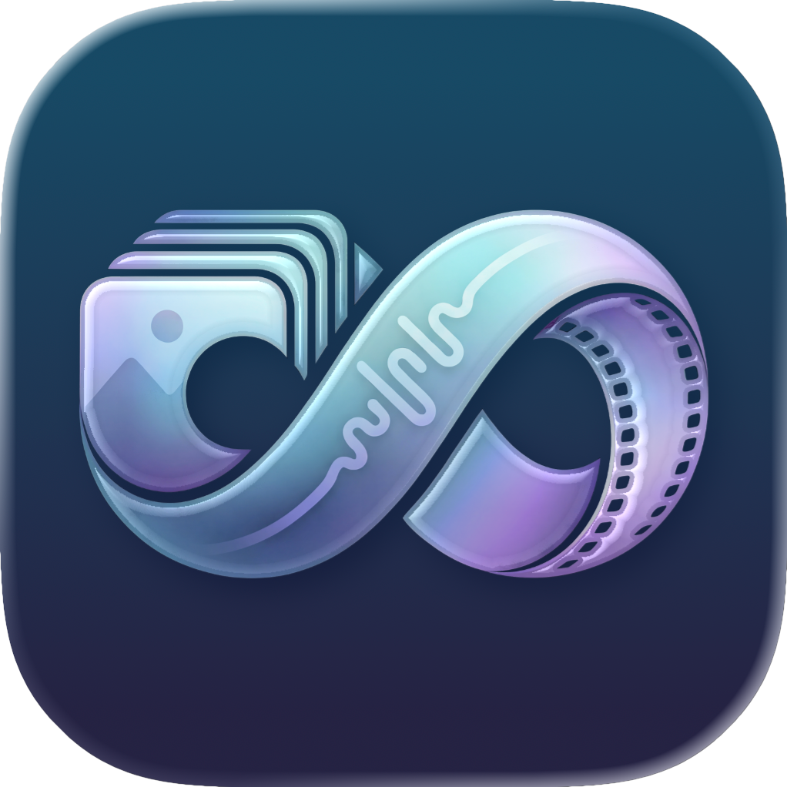

<p align="center">
  
</p>

<h1 align="center">Convertify</h1>

<p align="center">
  <strong>Open source</strong> macOS frontend for FFmpeg. Drag, drop, convert.
</p>

<p align="center">
  <a href="#building">Build it yourself</a> · <a href="#support">Get it on the App Store</a>
</p>

---

## What is this?

Convertify wraps FFmpeg in a clean, native interface. No command line needed. It's opinionated where it should be and flexible where it matters.

This project is **fully open source**. You can clone it, build it, modify it, and use it however you like.

- **Drag and drop** any video, audio, or image
- **Pick a format** and hit convert
- **Sensible defaults** that just work
- **Hardware acceleration** via Apple VideoToolbox when available

## Tools

Convertify includes several specialized tools:

| Tool | Description |
|------|-------------|
| **Convert** | Change format between video, audio, and image types |
| **Compress** | Reduce file size with quality presets |
| **Extract Audio** | Pull audio tracks from video files |
| **Trim** | Cut videos to a specific time range |
| **To GIF** | Convert video clips to animated GIFs |
| **Resize** | Crop and scale images/videos with visual preview |

## Supported Formats

| Video | Audio | Image |
|-------|-------|-------|
| MP4, MOV, MKV | MP3, AAC, FLAC | JPEG, PNG, WebP |
| WebM, AVI, GIF | WAV, OGG, M4A | HEIC, TIFF, BMP, ICO |

## Quality Presets

Three presets. No knob-twiddling required.

- **Fast** — Quick encode, smaller file
- **Balanced** — Good quality, reasonable speed
- **Quality** — Best output, takes longer

Need more control? Advanced options are there if you want them.

## Requirements

- macOS 14.0+
- FFmpeg installed (`brew install ffmpeg`)

## Building

### Quick Build

```bash
./build-app.sh
```

This will:
1. Build the app in release mode
2. Create the `Convertify.app` bundle
3. Generate the app icon
4. Launch the app automatically

### Clean Rebuild

If you need to rebuild from scratch (recommended after code changes):

```bash
swift package clean
rm -rf .build Convertify.app
./build-app.sh
```

Or as a one-liner:

```bash
swift package clean && rm -rf .build Convertify.app && ./build-app.sh
```

### Build with Xcode

Alternatively, open `Convertify.xcodeproj` in Xcode and build from there.

## Running the App

### After Building

The build script automatically launches the app. To run it manually:

```bash
open Convertify.app
```

### From Finder

Navigate to the project directory and double-click `Convertify.app`.

### Move to Applications (Optional)

To install permanently:

```bash
cp -r Convertify.app /Applications/
```

Then launch from Spotlight or the Applications folder.

## Project Structure

```
convertify/
├── Convertify/
│   ├── Models/           # Data models (MediaFile, OutputFormat, etc.)
│   ├── Views/            # SwiftUI views
│   ├── Services/         # FFmpeg integration, media probing
│   ├── Utilities/        # Command builders, helpers
│   └── Assets.xcassets/  # App icons and colors
├── branding/
│   ├── logo.png          # Source logo layer
│   ├── shadow.png        # Source shadow layer
│   └── generate-icons.py # Icon generation script
├── build-app.sh          # Build script
└── Package.swift         # Swift Package Manager config
```

## Support

Convertify is free to build and use. If you find it useful and want to support development, you can purchase it on the **Mac App Store** — same app, automatic updates, and a nice way to say thanks.

<!-- [Download on the Mac App Store](https://apps.apple.com/app/convertify) -->
